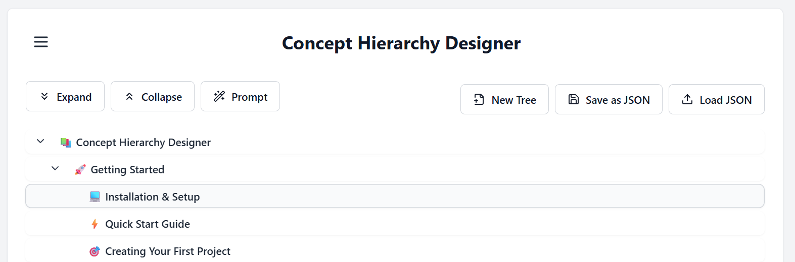

# 🌳 Concept Hierarchy Designer

A powerful interactive tool for creating, organizing, and visualizing hierarchical concept maps using AI assistance.

 <!-- Consider replacing this with an actual screenshot of your app -->

## ✨ Features

- 📋 Create and manage hierarchical concept trees
- 🔄 Drag and drop nodes to reorganize your hierarchy
- ⌨️ **Full keyboard navigation** with arrow keys and visual selection
- ✏️ Edit node labels and descriptions with **Markdown support**
- 📝 Rich text formatting in descriptions (bold, italic, code, lists, links)
- 🧠 AI-powered "Magic Wand" feature to generate child concepts copy/paste based technique
- 📋 Copy/cut/paste functionality for nodes and branches
- 🎯 Interactive capability cards with three-generation view
- 📤 **Export capability cards** in multiple formats (SVG, PNG, PDF, HTML, JSON)
- 🌈 Modern, responsive UI with animations
- 💾 Local storage persistence for your concept trees

## 🚀 Getting Started

### Prerequisites

- 📦 [Node.js](https://nodejs.org/) (v16.x or later)

### 🔧 Installation

1. **Clone the repository**
   ```bash
   git clone https://github.com/yourusername/concept-hierarchy-designer.git
   cd concept-hierarchy-designer
   ```

2. **Install dependencies**
   ```bash
   npm install
   ```

3. **Start the development server**
   ```bash
   npm run dev
   ```

4. **Open your browser**

   Navigate to http://localhost:5173 to view the app.

## 🛠️ Built With

- [React](https://react.dev/) - UI library
- [TypeScript](https://www.typescriptlang.org/) - Type-safe JavaScript
- [Vite](https://vitejs.dev/) - Fast development server and bundler
- [React DnD](https://react-dnd.github.io/react-dnd/) - Drag and drop for React
- [Framer Motion](https://www.framer.com/motion/) - Animation library
- [React Hot Toast](https://react-hot-toast.com/) - Toast notifications
- [React Markdown](https://github.com/remarkjs/react-markdown) - Markdown rendering
- [KaTeX](https://katex.org/) - Mathematical notation rendering

## 📖 How to Use

1. **Create a new concept tree** - Use the "New Tree" button
2. **Add child concepts** - Click the "+" button on any node
3. **Navigate efficiently** - Use arrow keys to move between nodes, or click to select
4. **Reorganize** - Drag and drop nodes to restructure your hierarchy
5. **Use Magic Wand** - Generate AI-suggested child concepts for any node
6. **Edit nodes** - Modify labels and descriptions by pressing Enter or clicking the edit icon
7. **View capability cards** - Click the capability card icon to see hierarchical overviews

## ⌨️ Keyboard Shortcuts

Enhance your productivity with these keyboard shortcuts:

### Tree Navigation
- **↑/↓ Arrow Keys** - Navigate between nodes in the tree
- **←/→ Arrow Keys** - Collapse/expand nodes and navigate to parent/first child
- **Home** - Jump to the first visible node
- **End** - Jump to the last visible node  
- **Enter** - Edit the selected node
- **Click or Tab** - Select a node for keyboard navigation

### Visual Selection
- Selected nodes are highlighted with a light gray background and border
- Keyboard navigation automatically scrolls selected nodes into view
- Selection state is maintained as you navigate the tree

### Modal Dialogs
- **ESC** - Close any modal dialog (cancel action)
- **Ctrl+Enter** (Cmd+Enter on Mac) - Submit/save form in modals:
  - Add Child Modal: Save new child concept
  - Edit Node Modal: Save node changes  
  - New Tree Modal: Create new tree
  - Magic Wand Settings: Save AI guidelines
- **Enter** - Confirm deletion in delete confirmation dialogs

### Tips
- Keyboard shortcuts work when modal dialogs are open
- Tree navigation only works when no input fields are focused
- Tooltips on buttons show the available shortcuts
- Form modals display helpful hints about keyboard shortcuts

### 📝 Markdown Support

Descriptions support full Markdown formatting, including:

- **Bold text** and *italic text*
- `inline code` and code blocks
- Bulleted and numbered lists
- [Links](https://example.com)
- Headers and other Markdown features
- 🧮 **Mathematical expressions** using LaTeX syntax:
  - Inline math: `$\sigma_x \sigma_p \ge \frac{\hbar}{2}$`
  - Display math: `$$E = mc^2$$`
  - Complex formulas: `$$\int_{-\infty}^{\infty} e^{-x^2} dx = \sqrt{\pi}$$`

The formatted descriptions are visible in:
- Node tooltips (hover over node names)
- Capability card displays
- All description viewing areas

## 🧪 Building for Production

To create a production build:

```bash
npm run build
```

Preview the production build locally:

```bash
npm run preview
```

## 🤝 Contributing

Contributions are welcome! Feel free to open issues or submit pull requests.

## 📄 License

This project is licensed under the MIT License - see the LICENSE file for details.
